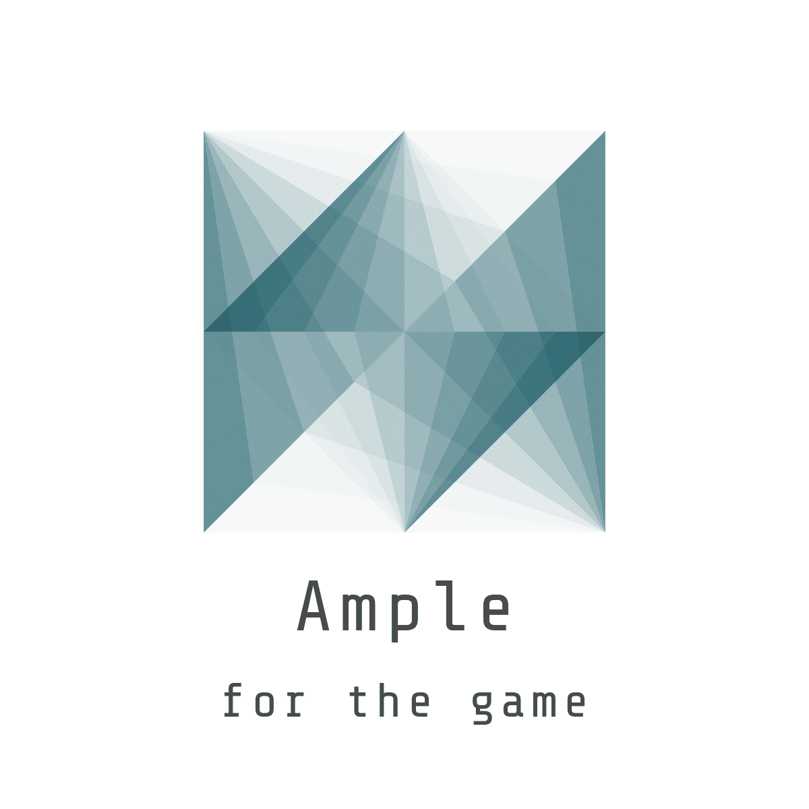

 
Ample
===================
**What is this?**\
This is a `C++` engine. 2D and 3D are based on OpenGL. Project is object-oriented, so you can, for example, return to the base classes like Activity and write, for example, command-like quest.

**Why?**\
Basically, i am obviously reinventing the wheel.

Documentation
---

## `ample`
> Description

### `ample::Activity`
> Description
#### `ample::Activity::addCondition(ample::Condition *)`
> Description
#### `ample::Activity::clearConditions()`
> Description
#### `ample::Activity::generateOutput()`
> Description
#### `ample::Activity::processInput()`
> Description
#### `ample::Activity::run()`
> Description
#### `ample::Activity::stop()`
> Description
#### `ample::Activity::updateConditions()`
> Description

---

### `ample::Condition`
> Description
#### `ample::Condition::init(ample::Activity *)`
> Description
#### `ample::Condition::update(ample::Activity *)`
> Description

---

### `ample::Storage`
> Description
#### `ample::Storage::getInt()`
> Description
#### `ample::Storage::getStr()`
> Description
#### `ample::Storage::set(int)`
> Description
#### `ample::Storage::set(std::string)`
> Description

---
