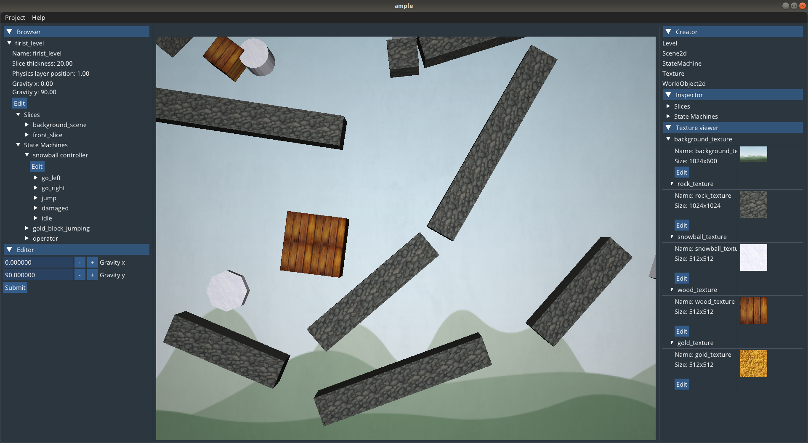
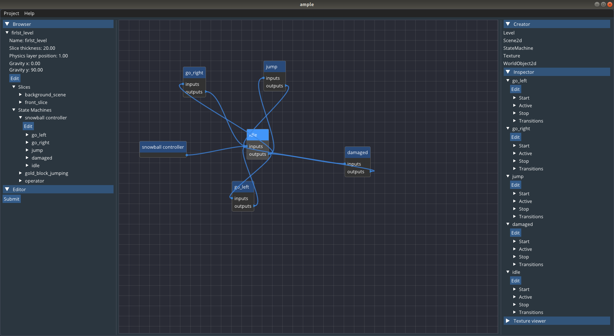

 

### Ample engine

3D Graphics, 2D physics game engine. Does not requires any programming
language knowledge for start. So far works only on Linux, other platforms support is coming. Project is in the developing stage at this moment. You may check out CONTRIBUTING.md if you want to help us :)

### Current feautures

- Static and dynamic physics objects

- Objects texturing

- Single light source

- Game logic is done using state machines

- Graphical user interface

### Future plans

- More actions for state machines

- 3D models uploading

- Python scripting

- Windows support

### Submodules and dependencies

- OpenGL (libgl1-mesa-dev)

- SDL2 (libsdl2-dev)

- DevIL (libdevil1c2 libdevil-dev)

- GLEW (libglew-dev)

- [box2d](https://github.com/erincatto/box2d) (commit [38d36d](https://github.com/erincatto/box2d/tree/38d36de77135da3d1a63a543d1342d6f7a99b721))

- [cxxopts](https://github.com/jarro2783/cxxopts) (commit [b0f67a0](https://github.com/jarro2783/cxxopts/tree/b0f67a06de3446aa97a4943ad0ad6086460b2b61))

- [googletest](https://github.com/google/googletest) (commit [e3f031](https://github.com/google/googletest/tree/e3f0319d89f4cbf32993de595d984183b1a9fc57))

- [imgui](https://github.com/ocornut/imgui) (commit [e8c986](https://github.com/ocornut/imgui/tree/e8c986b34ea5664688d1126eed784a5e297e7e11))

- [imgui-filebrowser](https://github.com/AirGuanZ/imgui-filebrowser) (commit [4b2dc7](https://github.com/AirGuanZ/imgui-filebrowser/tree/4b2dc76eceb41d66b13955324f8600fd892f2b2a))

- [imnodes](https://github.com/Nelarius/imnodes) (commit [32b7fe](https://github.com/Nelarius/imnodes/tree/32b7fe7eb6ec83b81e9bb083a0faf9d734a163a1))

- [rapidjson](https://github.com/Tencent/rapidjson) (commit [8f4c02](https://github.com/Tencent/rapidjson/tree/8f4c021fa2f1e001d2376095928fc0532adf2ae6))

### Install (Works on Ubuntu 18.04 for sure)

`$ git clone --recursive https://github.com/Glebanister/ample` \
`$ ./ci/travis/install-linux.sh`  - installs dependencies, requires apt. You may want to install them by yourself \
`$ mkdir build && cd build` \
`$ cmake .. -DCMAKE_CXX_COMPILER=g++-9` \
`$ make -j4` or just make, if you have some time and don't want this process to disturb you

If you have any problems with the construction of the project, please write about this in issue.

### Create your project with gui

`$ ./build/gui/ample-gui`

### Run project with executor

`$ ./build/engine/ample-engine -p <your-project-path>`
